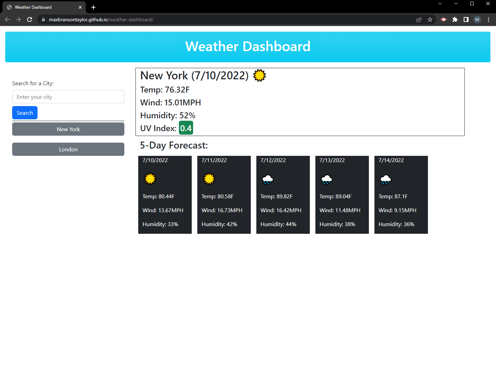

# Weather Dashboard

## Description

This application allows the user to request current weather data and 5-day forecasts for their desired city. This data is then stored in local storage for instant recall.  
Resources used: openweathermaps OneCall API, jQuery, Bootstrap.

[Link to deployed application](https://maxbransontaylor.github.io/weather-dashboard/)
